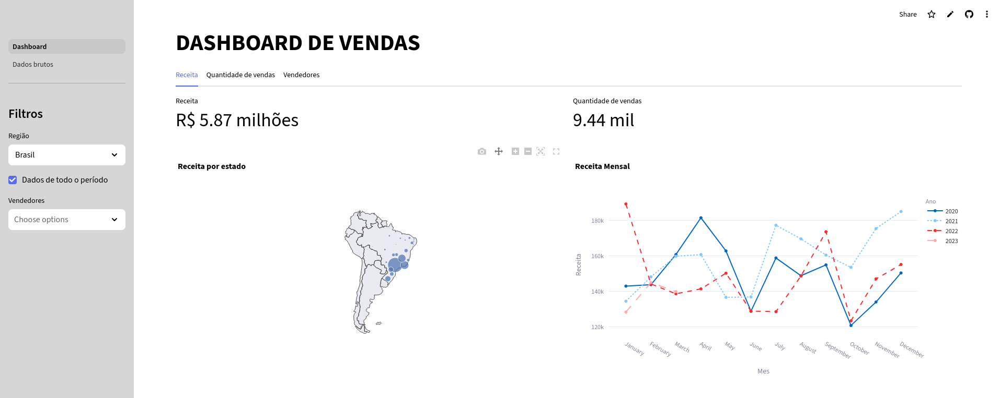
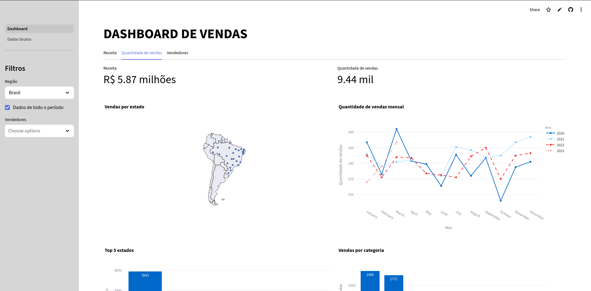
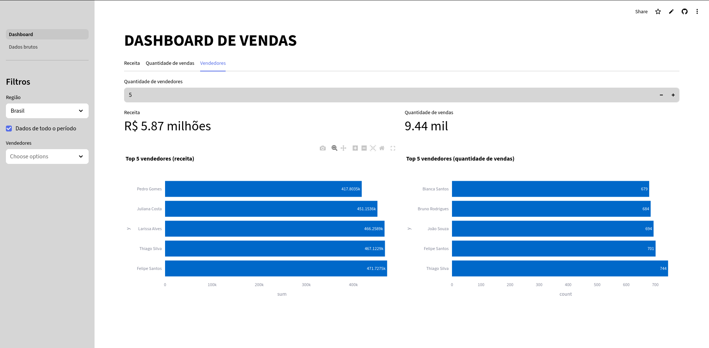
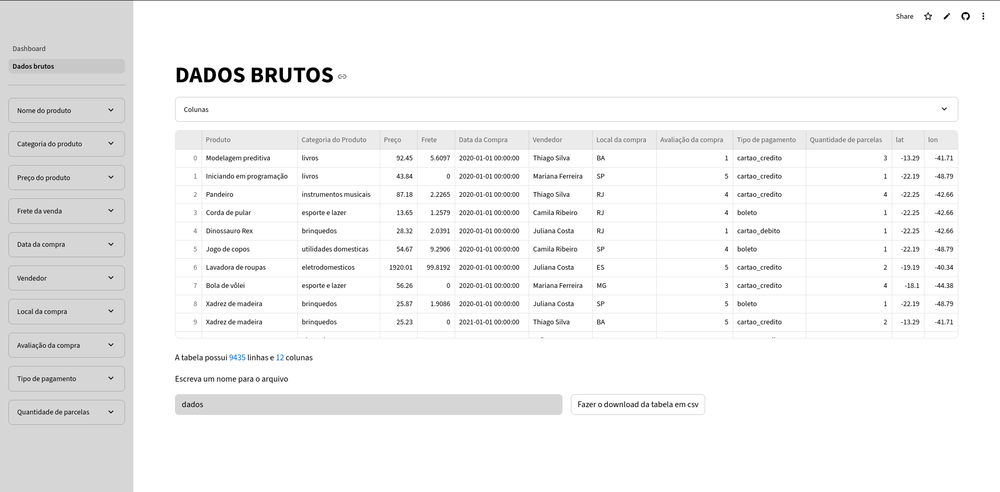

# 📊 Dashboard de Vendas

  

Este projeto é um **Dashboard de Vendas Interativo** desenvolvido com [Streamlit](https://streamlit.io/), utilizando `Pandas` para manipulação de dados e `Plotly` para visualizações interativas.

---

## Imagens Demonstrativas

Abaixo estão algumas capturas de tela que mostram as principais funcionalidades do app:

---

### Visão Geral da Receita

Nesta aba você encontra:
- **Receita total** acumulada  
- **Tops estados por receita** (ranking dos estados geradores de maior faturamento)  
- **Receita por categoria** de produto  
- **Evolução mensal da receita** (2020–2023) 
---

### Visão Geral de Vendas

Nesta aba você encontra:
- **Quantidade total de vendas** realizadas  
- **Tops estados por volume de vendas**  
- **Vendas por categoria** de produto  
- **Evolução mensal da quantidade de vendas** (2020–2023)

---

### Vendedores em Destaque

A aba de **vendedores** permite:
- Visualizar os **tops vendedores por receita**
- Ver os **tops vendedores por quantidade de vendas**
- Ajustar o número de vendedores exibidos (de 0 até 10 ou mais)

---

### Dados Brutos

A aba de **dados brutos** mostra a base completa utilizada no dashboard, com:
- Filtros por nome do produto, categoria, data, local de compra, forma de pagamento etc.
- Visualização e filtragem interativas
- Download da base de dados em CSV

---

## 🚀 Acesse o App Online

🔗 [https://matheusnajal-dashboard.streamlit.app/](https://matheusnajal-dashboard.streamlit.app/)

---